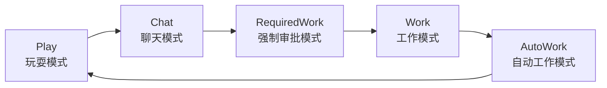
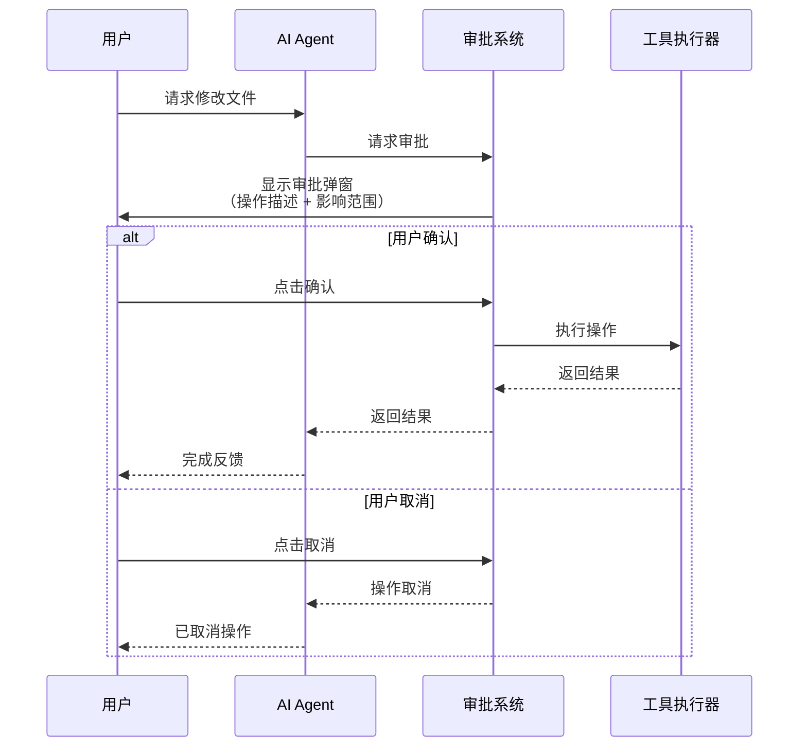
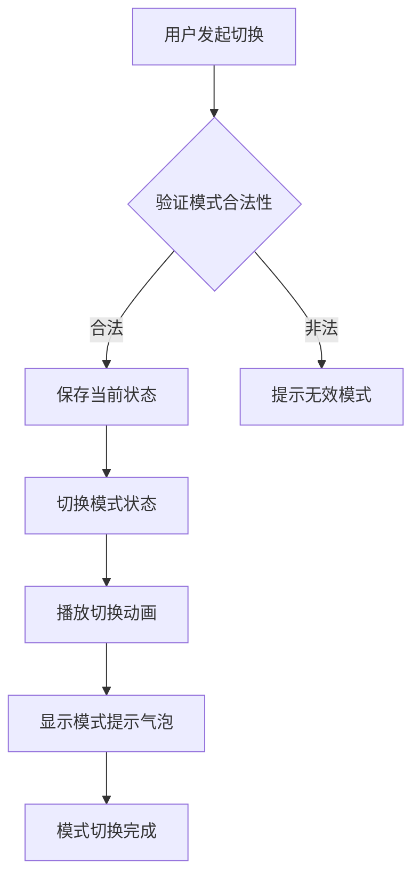
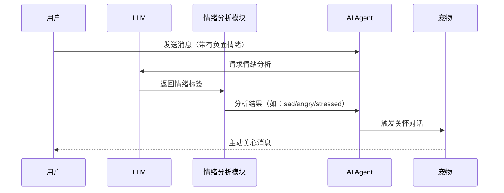
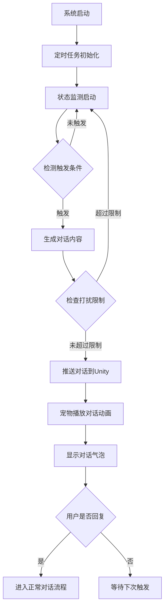
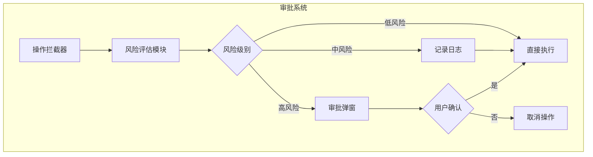

# AI 智能桌面宠物 - 交互模式与主动对话设计

---

## 文档信息

| 文档版本 | V1.0 |
| :--- | :--- |
| 项目名称 | AI 智能桌面宠物（AI Desktop Pet） |
| 文档类型 | 功能设计文档 |
| 编制日期 | 2026-07-11 |

---

## 一、交互模式系统

### 1.1 模式概述

系统支持五种交互模式，用户可随时切换，不同模式下AI的行为权限和响应方式不同：



### 1.2 模式详细设计

#### 1.2.1 Play（玩耍模式）

**核心功能**：屏幕互动，宠物展示各种可爱动作和表情

**特性设计**：

| 特性 | 描述 | 实现方案 |
| :--- | :--- | :--- |
| 覆盖屏幕防误触 | 用户进入玩耍模式后，宠物所在区域自动覆盖一层透明遮罩，防止点击穿透到下层窗口 | Unity Canvas 全屏透明面板 + 鼠标事件拦截 |
| 点击反馈 | 用户点击宠物时播放跳跃/转圈/撒娇等动画 | 射线检测命中后触发对应状态 |
| 拖拽移动 | 用户可拖拽宠物到任意位置 | DragManager + 平滑跟随 |
| 互动小游戏 | 支持简单的点击小游戏（如点击宠物头部得分） | 计时计分系统 |
| 表情反馈 | 根据用户操作实时展示不同表情（开心/害羞/惊讶） | Blend Shapes 切换 |

**状态切换**：
- 进入：播放欢快的入场动画，显示"来玩呀~"气泡
- 退出：播放挥手告别动画

#### 1.2.2 Chat（聊天模式）

**核心功能**：纯文本对话，可聊日常、开发、工作等任意话题

**特性设计**：

| 特性 | 描述 | 实现方案 |
| :--- | :--- | :--- |
| 日常闲聊 | 支持天气、新闻、娱乐等话题 | LLM 通用对话能力 |
| 技术交流 | 可聊开发、编程、架构等技术话题 | 系统提示词注入技术角色设定 |
| 工作讨论 | 可讨论工作安排、项目进度等 | 结合记忆系统获取工作相关信息 |
| 无操作权限 | 此模式下AI仅回复，不执行任何工具调用或文件操作 | Agent 禁用所有工具 |
| 打字机效果 | 对话内容逐字显示 | WebSocket 流式响应 + Unity 逐字渲染 |

**使用场景**：
- 午休时间与宠物闲聊放松
- 遇到技术问题时寻求建议
- 分享日常琐事

#### 1.2.3 RequiredWork（强制审批模式）

**核心功能**：AI做出任何工作决策前必须询问用户，获得明确授权后才可执行

**特性设计**：

| 特性 | 描述 | 实现方案 |
| :--- | :--- | :--- |
| 全流程审批 | 任何涉及修改的操作都需要用户确认 | 审批弹窗拦截所有工具执行 |
| 操作描述 | 弹窗显示详细的操作内容和影响范围 | LLM 生成操作摘要 |
| 影响评估 | 显示操作可能带来的风险和影响 | 工具执行前评估模块 |
| 确认机制 | 用户点击确认后才执行，点击取消则中止 | 双向确认流程 |
| 审批记录 | 所有审批操作记录到日志 | 持久化存储审批历史 |

**审批流程**：


**适用场景**：
- 涉及敏感文件修改时
- 执行不可逆操作时
- 用户对AI操作存疑时

#### 1.2.4 Work（工作模式）

**核心功能**：AI可修改文件、执行操作，但重要决策需用户审批确认

**特性设计**：

| 特性 | 描述 | 实现方案 |
| :--- | :--- | :--- |
| 分级审批 | 不同类型操作设置不同审批级别 | 操作类型映射审批策略 |
| 自动执行 | 低风险操作（查询、计算等）无需审批直接执行 | 操作风险评估模块 |
| 弹窗审批 | 中高风险操作（文件修改、系统操作等）需要弹窗确认 | 审批弹窗系统 |
| 操作日志 | 所有操作记录到日志文件 | 结构化日志输出 |

**审批级别划分**：

| 级别 | 操作类型 | 是否需要审批 | 示例 |
| :--- | :--- | :--- | :--- |
| 低风险 | 查询、计算、信息获取 | 否 | 查询天气、计算器、获取时间 |
| 中风险 | 文件读取、网页浏览 | 否 | 读取代码文件、搜索信息 |
| 高风险 | 文件修改、系统操作 | 是 | 修改代码、启动程序、设置提醒 |

**适用场景**：
- 日常开发工作
- 需要AI辅助但仍需把关
- 效率与安全平衡

#### 1.2.5 AutoWork（自动工作模式）

**核心功能**：AI无需审批，直接执行所有决策和操作

**特性设计**：

| 特性 | 描述 | 实现方案 |
| :--- | :--- | :--- |
| 无审批流程 | AI做出决策后直接执行，无需用户确认 | 审批系统完全跳过 |
| 快速响应 | 操作执行速度最快，无等待时间 | 异步执行 + 后台处理 |
| 执行通知 | 操作完成后通知用户结果 | Toast 通知 / 对话气泡 |
| 风险提示 | 切换到此模式时显示风险提示 | 模式切换确认弹窗 |

**风险提示内容**：
> ⚠️ 警告：您即将进入自动工作模式，AI将直接执行所有操作。请确保您信任当前AI配置和网络环境。

**适用场景**：
- 用户信任度高的环境
- 效率优先的场景
- 重复性任务自动化

### 1.3 模式切换设计

**切换方式**：

| 方式 | 操作 | 说明 |
| :--- | :--- | :--- |
| 右键菜单 | 右键点击宠物 → 选择模式 | 最直观的切换方式 |
| 快捷键 | `Ctrl+Alt+1` ~ `Ctrl+Alt+5` | 快速切换，对应五种模式 |
| 语音命令 | "切换到工作模式" | 语音识别支持 |
| 对话命令 | "请切换到玩耍模式" | LLM 意图识别 |

**模式切换流程**：


---

## 二、AI主动对话系统

### 2.1 功能概述

**创新性功能**：AI可主动发起对话，无需用户先开口。

这是本项目的核心创新点之一，旨在打造更具陪伴感的桌面宠物体验。

### 2.2 主动对话类型

| 类型 | 触发条件 | 实现方案 | 示例 |
| :--- | :--- | :--- | :--- |
| **定时问候** | 每天固定时间 | `sched` 定时任务调度 | "早上好呀！今天也要元气满满~" |
| **状态感知问候** | 用户活动状态变化 | `pynput` 监听 + 状态检测 | 用户长时间编码后休息时："休息一下吧，眼睛会累的~" |
| **情绪关怀** | 分析用户对话情绪 | LLM 情绪分析 | 检测到负面情绪："怎么啦？不开心的话可以跟我说说~" |
| **事件提醒** | 记忆系统匹配 | SQLite 查询 + 时间比对 | 纪念日、待办事项到期 |
| **随机闲聊** | 用户闲置一段时间 | 随机触发机制 | "嘿，在忙什么呢？" |

### 2.3 触发机制设计

#### 2.3.1 定时问候

**时间配置**：
- 早晨问候：09:00
- 午间问候：12:00
- 晚间问候：18:00
- 用户可自定义问候时间

**问候内容策略**：
- 结合天气信息："早上好！今天晴天，适合出门走走~"
- 结合日期："今天是周一，新的一周开始啦！"
- 结合用户习惯：根据记忆系统获取用户作息

#### 2.3.2 状态感知问候

**状态检测**：
- 用户空闲时间检测（键盘/鼠标无操作超过10分钟）
- 当前活动窗口检测（VS Code / 浏览器 / 游戏等）
- 系统时间检测（工作日/周末/节假日）

**响应策略**：
- 检测到用户在写代码："还在写代码呀？加油！需要我帮你查点资料吗？"
- 检测到用户在浏览网页："在看什么有趣的内容呀？"
- 检测到用户在玩游戏："玩得开心吗？注意劳逸结合哦~"

#### 2.3.3 情绪关怀

**情绪分析流程**：


**情绪响应规则**：

| 情绪 | 响应策略 | 示例回复 |
| :--- | :--- | :--- |
| sad（难过） | 表达关心，提供陪伴 | "抱抱你~有什么不开心的事可以跟我说说，我一直在~" |
| angry（生气） | 安抚情绪，转移注意力 | "别生气啦，深呼吸~要不要一起听首歌放松一下？" |
| stressed（压力大） | 提供鼓励和支持 | "感觉你压力好大，休息一下吧！我陪你聊聊天~" |
| happy（开心） | 分享喜悦，表达祝贺 | "哇，好开心听到这个消息！🎉 恭喜你呀~" |

#### 2.3.4 事件提醒

**事件类型**：
- 纪念日（生日、节日等）
- 待办事项（用户设定的任务）
- 重要日期（项目截止日期等）

**提醒机制**：
- 提前1天提醒："明天就是你的生日啦！🎂"
- 当天提醒："今天是XX纪念日哦~"
- 到期提醒："你设定的待办事项'完成项目报告'今天到期啦！"

#### 2.3.5 随机闲聊

**触发条件**：
- 用户空闲超过5分钟
- 距离上次对话超过30分钟
- 当前模式为 Chat 或 Play

**闲聊话题策略**：
- 根据记忆系统推荐用户感兴趣的话题
- 根据当前时间推荐合适话题（如中午聊美食）
- 根据用户习惯推荐话题

### 2.4 主动对话策略

#### 2.4.1 打扰控制策略

| 控制项 | 限制 | 实现方案 |
| :--- | :--- | :--- |
| 频率限制 | 每小时最多主动发起2次对话 | 计数器 + 时间窗口 |
| 工作模式限制 | Work/AutoWork 模式下不主动发起闲聊 | 模式检测 |
| 免打扰时段 | 用户可设置免打扰时间（如深夜） | 配置文件 + 时间检测 |
| 用户反馈 | 用户明确表示"别打扰我"后停止主动对话 | 意图识别 + 状态标记 |

#### 2.4.2 语境感知策略

**当前活动窗口检测**：
```python
import pygetwindow as gw

def get_active_window():
    return gw.getActiveWindowTitle()

# 根据窗口标题判断用户活动
active_window = get_active_window()
if "Visual Studio" in active_window or "VS Code" in active_window:
    topic = "coding"
elif "Chrome" in active_window or "Edge" in active_window:
    topic = "browsing"
elif "Word" in active_window or "Excel" in active_window:
    topic = "work"
```

**话题生成策略**：
- 编码时：推荐技术话题、代码优化建议
- 浏览网页时：推荐新闻、趣事
- 办公时：推荐效率工具、工作技巧

#### 2.4.3 情感匹配策略

| 场景 | 语气风格 | 示例 |
| :--- | :--- | :--- |
| 工作时间 | 简洁、专业、鼓励 | "加油！你可以的~" |
| 休息时间 | 轻松、活泼、可爱 | "来玩呀！🎮" |
| 深夜 | 温柔、关心 | "这么晚还在忙？注意身体哦~" |
| 用户情绪低落 | 温暖、安慰 | "抱抱你~一切都会好起来的！" |

#### 2.4.4 话题推荐策略

**话题来源**：
- 记忆系统：用户之前提到的兴趣爱好
- 实时数据：天气、新闻、日期
- 用户活动：当前正在做的事情

**话题生成示例**：
```
记忆系统：用户喜欢打篮球
实时数据：今天天气晴朗
用户活动：正在写代码

推荐话题："今天天气这么好，写完代码要不要去打会儿篮球？🏀"
```

### 2.5 主动对话流程



---

## 三、审批机制设计

### 3.1 审批系统架构



### 3.2 审批弹窗设计

**弹窗内容**：

| 区域 | 内容 | 说明 |
| :--- | :--- | :--- |
| 标题栏 | 操作类型图标 + 标题 | "⚠️ 高风险操作确认" |
| 操作描述 | 详细描述即将执行的操作 | "即将修改文件：E:\project\main.py" |
| 影响范围 | 操作可能影响的范围 | "影响范围：当前项目" |
| 风险等级 | 风险等级标识 | 红色高亮显示 |
| 确认按钮 | "确认执行" | 点击后执行操作 |
| 取消按钮 | "取消" | 点击后中止操作 |

**弹窗样式**：
- 半透明背景遮罩，聚焦用户注意力
- 居中显示，大小自适应内容
- 动画过渡效果，平滑弹出

### 3.3 操作风险评估

**评估维度**：

| 维度 | 权重 | 评估内容 |
| :--- | :--- | :--- |
| 操作类型 | 40% | 文件修改 > 文件读取 > 信息查询 |
| 影响范围 | 30% | 系统级 > 项目级 > 局部级 |
| 可逆性 | 20% | 不可逆 > 可恢复 > 完全可逆 |
| 用户信任度 | 10% | 用户历史审批记录分析 |

**评估算法**：
```python
def calculate_risk(operation):
    risk_score = 0
    
    # 操作类型评分
    if operation.type == "file_modify":
        risk_score += 80
    elif operation.type == "file_read":
        risk_score += 30
    elif operation.type == "query":
        risk_score += 10
    
    # 影响范围评分
    if operation.scope == "system":
        risk_score += 60
    elif operation.scope == "project":
        risk_score += 30
    elif operation.scope == "local":
        risk_score += 10
    
    # 可逆性评分
    if operation.reversible:
        risk_score -= 20
    
    return risk_score

# 风险等级判定
def get_risk_level(score):
    if score >= 100:
        return "high"
    elif score >= 50:
        return "medium"
    else:
        return "low"
```

---

## 四、实现优先级

| 优先级 | 功能 | 说明 |
| :--- | :--- | :--- |
| P0 | Chat 模式 | 基础对话功能，必须优先实现 |
| P0 | Play 模式 | 核心互动功能，提升用户体验 |
| P1 | Work 模式 | 实用工作功能，提升工具价值 |
| P1 | RequiredWork 模式 | 安全保障，必要功能 |
| P2 | AutoWork 模式 | 高级功能，效率优先 |
| P1 | 定时问候 | 主动对话基础功能 |
| P2 | 状态感知问候 | 需要感知模块支持 |
| P2 | 情绪关怀 | 需要情绪分析能力 |
| P2 | 事件提醒 | 需要记忆系统支持 |
| P3 | 随机闲聊 | 锦上添花功能 |