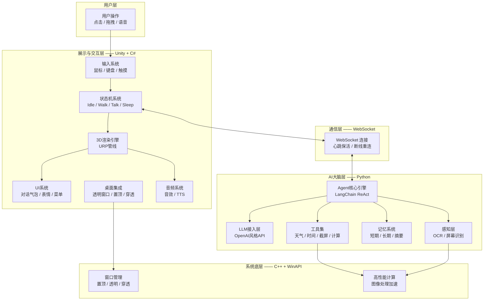

# AI 智能桌面宠物 - 技术方案设计书

---

## 文档信息

| 文档版本 | V1.0 |
| :--- | :--- |
| 项目名称 | AI 智能桌面宠物（AI Desktop Pet） |
| 文档类型 | 技术方案设计书 |
| 编制日期 | 2026-07-07 |
| 技术栈 | Unity + C# / Python / C++ |

---

## 一、项目概述

### 1.1 项目背景

本项目旨在打造一款运行于 Windows 桌面环境的 3D 智能交互宠物。该宠物具备实时 AI 对话能力与智能体（Agent）任务执行能力，能够通过自然语言与用户交互，执行信息查询、系统控制等任务，并提供情感化的桌面陪伴体验。

### 1.2 项目目标

- 构建一个 3D 桌面宠物，具备完整的渲染与动画表现
- 集成大语言模型（LLM），实现自然语言对话
- 赋予宠物 Agent 能力，支持工具调用与任务执行
- 实现桌面级交互体验（置顶、透明、穿透、拖拽）
- 具备记忆能力，实现跨会话的个性化体验
- 支持同时运行最多 3 个宠物实例

### 1.3 目标用户与定位

**目标用户**：无特定人群限制，面向所有对桌面宠物和 AI 交互感兴趣的用户。

**商业模式**：完全免费，开源或个人学习用途。软件本身不收取任何费用。

**API 费用说明**：大语言模型（LLM）的 API 调用费用由用户自行承担。用户可自由配置自己的 API Key，包括免费接口（如 Z.AI 等）和付费接口。

### 1.4 技术路线总览

| 层级 | 技术选型 | 职责描述 |
| :--- | :--- | :--- |
| 前端交互层 | Unity 2022 LTS + C# | 3D渲染、动画控制、UI呈现、桌面集成 |
| AI大脑层 | Python 3.10+ + LangChain | LLM调用、Agent推理、工具执行、记忆管理 |
| 系统底层 | C++17 + Win32 API | 窗口管理、系统交互、高性能计算 |
| 通信协议 | WebSocket（JSON-RPC 2.0） | 前后端双向实时通信 |

---

## 二、系统架构设计

### 2.1 整体架构图



### 2.2 数据流说明

1. 用户点击/拖拽宠物触发交互事件 → Unity 状态机响应
2. 用户输入文本 → Unity 通过 WebSocket 发送至 Python 服务
3. Python Agent 进行意图识别 → 调用 LLM 推理 → 执行工具调用（如有）
4. Python 将回复及动作指令封装为 JSON → 通过 WebSocket 返回 Unity
5. Unity 解析指令 → 切换状态机 → 播放对应动画 → 显示对话气泡

---

## 三、项目目录结构

```
AIDesktopPet/
│
├── UnityProject/
│   ├── Assets/
│   │   ├── _Project/
│   │   │   ├── Animations/               # 动画资源 (.anim)
│   │   │   │   ├── Idle.anim
│   │   │   │   ├── Walk.anim
│   │   │   │   ├── Talk.anim
│   │   │   │   ├── Jump.anim
│   │   │   │   ├── Sleep.anim
│   │   │   │   └── Wave.anim
│   │   │   ├── Art/
│   │   │   │   ├── Models/              # 3D模型 (.fbx / .glb)
│   │   │   │   │   ├── Pet/
│   │   │   │   │   └── Props/
│   │   │   │   ├── Materials/           # 材质资源
│   │   │   │   ├── Textures/            # 贴图资源
│   │   │   │   └── UI/                  # UI素材
│   │   │   ├── Scripts/
│   │   │   │   ├── Core/                # 核心控制
│   │   │   │   │   ├── PetController.cs
│   │   │   │   │   └── GameManager.cs
│   │   │   │   ├── StateMachine/        # 状态机
│   │   │   │   │   ├── IState.cs
│   │   │   │   │   ├── StateMachine.cs
│   │   │   │   │   ├── IdleState.cs
│   │   │   │   │   ├── TalkState.cs
│   │   │   │   │   ├── WalkState.cs
│   │   │   │   │   └── SleepState.cs
│   │   │   │   ├── Network/             # 网络通信
│   │   │   │   │   ├── WebSocketClient.cs
│   │   │   │   │   ├── MessageRouter.cs
│   │   │   │   │   └── MessageTypes.cs
│   │   │   │   ├── Desktop/             # 桌面集成
│   │   │   │   │   ├── WindowManager.cs
│   │   │   │   │   ├── ClickThroughManager.cs
│   │   │   │   │   └── DragManager.cs
│   │   │   │   ├── UI/                  # 用户界面
│   │   │   │   │   ├── DialogueBubble.cs
│   │   │   │   │   ├── EmotionIcon.cs
│   │   │   │   │   └── ContextMenu.cs
│   │   │   │   ├── Audio/               # 音频系统
│   │   │   │   │   └── AudioManager.cs
│   │   │   │   └── Utils/               # 工具类
│   │   │   │       ├── ObjectPool.cs
│   │   │   │       ├── Logger.cs
│   │   │   │       └── ConfigManager.cs
│   │   │   ├── Configs/
│   │   │   │   ├── PetConfig.asset
│   │   │   │   └── UIConfig.asset
│   │   │   └── Scenes/
│   │   │       └── Main.unity
│   │   ├── Plugins/
│   │   │   ├── x86_64/
│   │   │   │   └── native_plugin.dll
│   │   │   └── WebSocket/
│   │   └── StreamingAssets/
│   ├── Packages/
│   ├── ProjectSettings/
│   └── Builds/
│
├── PythonAgent/
│   ├── src/
│   │   ├── main.py
│   │   ├── server.py
│   │   ├── agent/
│   │   │   ├── core.py
│   │   │   ├── personality.py
│   │   │   └── prompt_templates.py
│   │   ├── llm/
│   │   │   ├── client.py
│   │   │   ├── streaming.py
│   │   │   └── fallback.py
│   │   ├── tools/
│   │   │   ├── base.py
│   │   │   ├── weather.py
│   │   │   ├── time.py
│   │   │   ├── screenshot.py
│   │   │   ├── calculator.py
│   │   │   ├── system_info.py
│   │   │   └── registry.py
│   │   ├── memory/
│   │   │   ├── short_term.py
│   │   │   ├── long_term.py
│   │   │   └── summarizer.py
│   │   ├── perception/
│   │   │   ├── screen_analyzer.py
│   │   │   └── ocr.py
│   │   ├── handlers/
│   │   │   ├── message_handler.py
│   │   │   └── action_handler.py
│   │   └── utils/
│   │       ├── logger.py
│   │       ├── config.py
│   │       └── validators.py
│   ├── tests/
│   ├── logs/
│   ├── data/
│   │   └── memory.db
│   ├── requirements.txt
│   ├── .env.example
│   └── config.yaml
│
├── CppNative/
│   ├── src/
│   │   ├── window_utils.cpp
│   │   ├── transparency.cpp
│   │   ├── click_through.cpp
│   │   ├── image_processor.cpp
│   │   └── exports.cpp
│   ├── include/
│   │   └── window_utils.h
│   ├── CMakeLists.txt
│   └── build/
│
├── docs/
│   ├── architecture.md
│   ├── api_protocol.md
│   └── user_manual.md
│
├── tools/
│   ├── model_exporter/
│   └── asset_pipeline/
│
├── scripts/
│   ├── build_unity.bat
│   ├── build_python.bat
│   ├── build_cpp.bat
│   └── run_all.bat
│
├── .gitignore
└── README.md
```

---

## 四、功能模块详细设计

### 4.1 Unity + C# 前端交互层

#### 4.1.1 桌面集成模块

| 功能 | 实现方案 | 技术依赖 | 验收标准 |
| :--- | :--- | :--- | :--- |
| 无边框透明窗口 | `DwmExtendFrameIntoClientArea` 扩展窗口帧到客户区 | `dwmapi.dll` | 窗口背景完全透明，仅显示3D内容 |
| 窗口置顶 | `SetWindowPos` 设置 `HWND_TOPMOST` 标志 | `user32.dll` | 宠物始终显示在所有窗口之上 |
| 点击穿透 | `SetWindowLong` 设置 `WS_EX_TRANSPARENT` 扩展样式 | `user32.dll` | 鼠标点击透明区域时穿透至下层窗口 |
| 区域交互 | Unity `Physics.Raycast` 检测点击命中 | Unity Physics | 仅点击宠物模型时触发交互事件 |
| 窗口拖拽 | `WM_NCHITTEST` 消息返回 `HTCAPTION` | `user32.dll` | 鼠标按住宠物任意位置可拖拽移动 |
| 边缘吸附 | 实时检测窗口与屏幕边缘距离，触发平滑移动 | Unity `Update` 循环 | 拖拽至屏幕边缘时自动吸附停靠 |
| 多显示器支持 | `Screen` 类遍历所有显示器 | Unity API | 宠物可在多显示器间自由移动 |
| DPI适配 | `SetProcessDPIAware` 声明 DPI 感知 | `user32.dll` | 系统缩放比例变化时窗口清晰显示 |

#### 4.1.2 3D渲染模块

| 功能 | 实现方案 | 技术依赖 | 验收标准 |
| :--- | :--- | :--- | :--- |
| 模型导入 | Unity Asset Importer 处理 `.fbx` / `.glb` | Unity Editor | 模型正确显示，材质映射无误 |
| Shader系统 | URP Shader Graph 自定义材质 | Unity URP | 支持颜色/纹理/金属度/光滑度调节 |
| 骨骼动画 | `Animator` + `Avatar` 驱动骨骼 | Unity Animation | 待机/行走/跳跃/对话动画流畅播放 |
| 动画混合 | `Blend Tree` 实现状态间平滑过渡 | Unity Animation | 状态切换时动作自然衔接 |
| 面部表情 | `Blend Shapes` 控制面部变形 | Unity SkinnedMeshRenderer | 高兴/伤心/惊讶/生气表情切换 |
| 粒子特效 | `Particle System` 播放情绪粒子 | Unity Particle | 心形/星星/音符特效 |
| 光照系统 | URP 主光源 + 补光 + 阴影 | Unity URP | 模型立体感清晰 |
| 摄像机控制 | `Cinemachine` 虚拟摄像机 | Unity Cinemachine | 固定视角 / 跟随视角切换 |

#### 4.1.3 状态机系统

**状态定义：**

| 状态 | 优先级 | 触发条件 | 行为描述 |
| :--- | :--- | :--- | :--- |
| Idle | 0（最低） | 无其他状态触发 | 播放待机动画，随机眨眼/环顾/小动作 |
| Walk | 1 | 用户拖拽 / 主动移动 | 向目标位置移动，播放行走动画 |
| Talk | 2 | 收到AI回复 | 播放对话动画，显示对话气泡 |
| Sleep | 1 | 用户闲置超时 / 指令 | 播放睡眠动画，降低呼吸频率 |
| Interact | 3（最高） | 用户点击/抚摸 | 播放被摸头/跳跃/转圈等反馈动画 |

**状态机设计：**

- 实现 `IState` 接口（`OnEnter` / `OnUpdate` / `OnExit`）
- `StateMachine` 维护当前状态及状态切换逻辑
- 支持状态优先级抢占（高优先级可打断低优先级）
- 状态切换时触发对应动画播放

#### 4.1.4 UI系统

| 功能 | 实现方案 | 验收标准 |
| :--- | :--- | :--- |
| 对话气泡 | `TextMeshPro` + 背景图片 + Canvas | 文本逐字显示，气泡自适应大小 |
| 表情图标 | `Image.sprite` 切换 | 情绪变化时图标同步切换 |
| 右键菜单 | Unity `ContextMenu` + `Dropdown` | 显示设置/切换模式/退出等功能项 |
| 连接状态指示器 | 小圆点颜色变化（绿=在线 / 黄=思考 / 红=离线） | 状态变化实时反馈 |
| 设置面板 | UGUI Panel 实现参数调节 | 性格/音量/透明度/开机启动等配置 |
| 对象池 | `Queue<GameObject>` 缓存UI元素 | 频繁创建销毁时不产生GC峰值 |

#### 4.1.5 音频系统

| 功能 | 实现方案 | 验收标准 |
| :--- | :--- | :--- |
| 交互音效 | `AudioSource.PlayOneShot` | 点击/拖拽/开关菜单播放对应音效 |
| TTS语音 | 接收Python端音频流，`AudioSource` 播放 | AI回复同时播放语音 |
| 背景音乐 | `AudioSource` 循环播放 | 可开关，音量独立控制 |
| 音量控制 | Unity Audio Mixer | 主音量/音效/语音/TTS 分路控制 |
| 音频池 | `Dictionary<string, AudioClip>` 预加载缓存 | 播放无加载延迟 |

#### 4.1.6 通信模块

| 功能 | 实现方案 | 验收标准 |
| :--- | :--- | :--- |
| WebSocket连接 | `NativeWebSocket` 库建立全双工连接 | 成功连接Python服务端 |
| 连接管理 | 封装连接状态机（Disconnected / Connecting / Connected / Reconnecting） | 状态变化可控 |
| 消息序列化 | `Newtonsoft.Json` 序列化/反序列化 | JSON格式符合协议规范 |
| 请求ID匹配 | `Dictionary<string, Action<object>>` 存储回调 | 异步请求能正确匹配响应 |
| 心跳保活 | 每30秒发送Ping帧 | 长时间无消息连接保持活跃 |
| 超时处理 | `CancellationTokenSource` 设置超时 | 请求超时自动取消并触发降级 |
| 断线重连 | 指数退避策略（1s, 2s, 4s, 8s, 上限30s） | 网络恢复后自动重建连接 |
| 离线消息队列 | `Queue` 缓存待发送消息 | 重连后自动补发 |

#### 4.1.7 核心控制器

| 功能 | 实现方案 | 验收标准 |
| :--- | :--- | :--- |
| 主控制器 | 单例模式 `PetController` 协调所有子系统 | 各模块通过主控统一调度 |
| 配置管理 | `ScriptableObject` 存储 + `PlayerPrefs` 持久化 | 配置修改后重启生效 |
| 日志系统 | `Debug.Log` + 文件输出（`Application.persistentDataPath`） | 分级记录（Info / Warning / Error） |
| 异常处理 | `Application.logMessageReceived` 全局捕获 | 异常时写入日志，尝试自动恢复 |

#### 4.1.8 通信协议规范（JSON-RPC 2.0）

**请求格式（Unity → Python）：**

```json
{
  "jsonrpc": "2.0",
  "method": "chat",
  "params": {
    "text": "今天天气怎么样？",
    "context": {
      "pet_state": "idle",
      "user_name": "主人"
    }
  },
  "id": "req-550e8400-e29b-41d4-a716-446655440000"
}
```

**响应格式（Python → Unity）：**

```json
{
  "jsonrpc": "2.0",
  "result": {
    "reply": "今天晴天，气温25°C，适合出门走走~",
    "action": "jump",
    "emotion": "happy"
  },
  "id": "req-550e8400-e29b-41d4-a716-446655440000"
}
```

**错误响应格式：**

```json
{
  "jsonrpc": "2.0",
  "error": {
    "code": -32000,
    "message": "LLM服务不可用"
  },
  "id": "req-550e8400-e29b-41d4-a716-446655440000"
}
```

**方法定义：**

| Method | 方向 | 说明 |
| :--- | :--- | :--- |
| `chat` | Unity → Python | 发送用户输入，请求AI回复 |
| `action` | Unity → Python | 通知宠物当前状态变化 |
| `config` | Unity → Python | 更新Agent配置（性格/温度等） |
| `notify` | Python → Unity | 主动推送消息（定时提醒/主动对话） |

---

### 4.2 Python + AI 大脑层

#### 4.2.1 服务框架模块

| 功能 | 实现方案 | 验收标准 |
| :--- | :--- | :--- |
| WebSocket服务器 | `FastAPI` + `WebSocket` 端点 | 接收Unity连接，支持多客户端 |
| 请求路由 | 注册表模式，按 `method` 分发 | 新增方法无需修改核心代码 |
| 连接管理 | 维护连接池 + 心跳监控 | 异常断开时自动清理 |
| 配置加载 | `PyYAML` 加载 `.yaml` + `python-dotenv` 加载 `.env` | 配置变更无需重启服务 |
| 日志系统 | `Loguru` 输出至控制台 + 文件 | 结构化日志（时间/级别/模块/内容） |
| 生命周期 | `asyncio` 事件循环管理启动/停止/重载 | 优雅关闭（SIGINT/SIGTERM处理） |
| 健康检查 | `/health` HTTP端点返回服务状态 | 监控系统可探测服务可用性 |

#### 4.2.2 LLM集成模块

| 功能 | 实现方案 | 验收标准 |
| :--- | :--- | :--- |
| 统一客户端 | OpenAI SDK，通过 `base_url` + `api_key` 切换 | 配置变更即可切换任意兼容服务 |
| 多模型配置 | `config.yaml` 中定义 `models` 列表 | 支持主模型 + 备用模型配置 |
| 本地模型 | `base_url=http://localhost:11434/v1` 接入 Ollama | 离线环境可正常运行 |
| 国内模型 | 接入 DeepSeek / 智谱GLM / 通义千问 | 填写各厂商兼容端点即可使用 |
| 第三方代理 | 接入 OneAPI / NewAPI 等聚合网关 | 通过统一端点管理多模型 |
| 流式响应 | `AsyncGenerator` 逐Token返回 | Unity端实现打字机效果 |
| 上下文管理 | `List[Dict]` 维护消息历史 | 支持多轮对话 |
| Token计数 | `tiktoken` 统计消耗 | 可监控成本 |
| 降级策略 | 主模型异常时自动切换备用 | 任意模型可用即可返回结果 |
| 重试机制 | `tenacity.retry` 指数退避（初始1s，最大30s，最多3次） | 临时故障自动恢复 |

**配置示例（`config.yaml`）：**

```yaml
llm:
  models:
    primary:
      provider: "openai"
      base_url: "https://api.openai.com/v1"
      api_key: "${OPENAI_API_KEY}"
      model_name: "gpt-4o-mini"
      temperature: 0.8
    fallback:
      provider: "deepseek"
      base_url: "https://api.deepseek.com/v1"
      api_key: "${DEEPSEEK_API_KEY}"
      model_name: "deepseek-chat"
      temperature: 0.7
    local:
      provider: "ollama"
      base_url: "http://localhost:11434/v1"
      api_key: "ollama"
      model_name: "qwen2.5:7b"
      temperature: 0.9
```

**API 费用与接口说明**：

- 所有 LLM API 调用费用由用户自行承担，本项目仅提供接入能力，不代理、不中转任何 API 请求
- 用户可自由配置各类接口，包括免费接口（如 Z.AI 等）和付费接口
- 用户需自行申请并管理 API Key，项目不提供任何共享 Key
- 建议用户优先使用免费或本地模型接口以降低使用成本

#### 4.2.3 Agent核心模块

| 功能 | 实现方案 | 验收标准 |
| :--- | :--- | :--- |
| 推理引擎 | LangChain `ReAct Agent` 实现 Thought → Action → Observation | 自动选择工具完成用户指令 |
| 工具调用 | `ToolExecutor` 动态执行已注册工具 | 工具调用成功率 > 95% |
| 性格配置 | `PromptTemplate` 注入系统提示词 | 同一模型可输出不同风格回复 |
| 角色设定 | 核心 System Prompt：“你是一只可爱的电子宠物，名叫XXX，性格XXX” | 回复语气符合设定 |
| 对话记忆 | `ConversationBufferMemory` 保留上下文 | 5轮内对话有连贯性 |
| 意图识别 | LLM推理 + 关键词匹配 | 区分闲聊/指令/查询三类意图 |
| 任务规划 | `Plan-and-Execute` 模式分解复杂任务 | “安排明天日程”自动拆分为查询日历+添加提醒 |

#### 4.2.4 工具集

| 工具名称 | 功能 | 实现方案 | 输入参数 | 输出 |
| :--- | :--- | :--- | :--- | :--- |
| `get_weather` | 查询实时天气 | 免费天气API（如 wttr.in / OpenWeatherMap） | `city: str` | 温度/天气状况/湿度 |
| `get_time` | 获取当前时间日期 | `datetime` 模块 | `timezone: str`（可选） | 格式化时间字符串 |
| `screenshot` | 捕获屏幕 | `mss` + `PIL` | `region: tuple`（可选） | 截图像素数据 |
| `analyze_screen` | 分析屏幕内容 | 调用VLM（如 GPT-4V）或本地 OCR | `query: str` | 图像理解结果 |
| `calculate` | 数学计算 | 安全 `eval` + `operator` 限制 | `expression: str` | 计算结果 |
| `system_info` | 查询系统状态 | `psutil` | `info_type: str`（cpu/memory/disk） | 系统信息 |
| `web_search` | 网络搜索 | 搜索API（如 Tavily / Bing Search） | `query: str` | 搜索结果摘要 |
| `set_reminder` | 设置定时提醒 | `sched` + `threading` | `time: str`, `message: str` | 确认信息 |
| `open_app` | 启动系统应用 | `subprocess.Popen` | `app_name: str` | 启动结果 |

#### 4.2.5 记忆系统

**记忆存储架构（模仿 OpenClaw 方式）**：

记忆文件存放在用户目录下，路径为 `C:\Users\{用户名}\AI-Desktop-Pet\memory\`，与程序本体分离，便于持久化和迁移。

```
C:\Users\{用户名}\
└── AI-Desktop-Pet\           # 程序专用数据文件夹
    └── memory\                # 记忆系统根目录
        ├── LongTerm\          # 长期记忆（持久化存储，由 AI Agent 自由划分文件）
        └── ShortMemory\       # 短期记忆（近期对话上下文，由 AI Agent 自由划分文件）
```

> **说明**：`LongTerm\` 和 `ShortMemory\` 目录下不再预设固定文件名，具体文件的组织方式、命名和划分由 AI Agent 根据实际对话内容和记忆类型自主决定。

| 功能 | 实现方案 | 数据结构 | 验收标准 |
| :--- | :--- | :--- | :--- |
| 短期记忆 | `ShortMemory/` 目录下存储近期对话，滑动窗口保留最近20条 | JSONL 格式，文件由 AI Agent 自由划分 | 窗口内对话完整可回溯 |
| 长期记忆 | `LongTerm/` 目录下持久化存储，文件组织方式由 AI Agent 自主决定 | JSONL 格式，每行一条记录 | 重启服务后记忆可恢复 |
| 用户偏好 | AI Agent 根据对话自动提取并存储用户姓名/喜好/习惯 | 键值对存储 | "我叫XXX"后续对话能正确称呼 |
| 情感记忆 | AI Agent 自主记录对话中检测到的情绪事件 | 情绪标签 + 时间戳 | 可查询"上次开心是什么时候" |
| 记忆压缩 | 每天凌晨 12:00 a.m. 自动触发压缩任务，将当天 ShortMemory 中的记忆内容压缩至 LongTerm。若用户此时仍在使用，则推迟至用户停止使用 1 分钟后执行 | LLM 生成摘要，写入 LongTerm | 压缩后当天短期记忆已归档，长期记忆可恢复 |
| 记忆检索 | JSONL 文件遍历 + 关键词匹配 | 关键词匹配 | "我之前说过什么"能返回相关记录 |
| 重要性评估 | 简单遗忘曲线（访问频率 + 最近访问时间） | 定期清理低重要性记忆 | 长期记忆不超过1000条 |

#### 4.2.6 感知模块

| 功能 | 实现方案 | 验收标准 |
| :--- | :--- | :--- |
| 屏幕OCR | `PaddleOCR` / `Tesseract` 识别屏幕文字 | 可识别桌面图标文字/弹窗内容 |
| 图像识别 | `CLIP` / `BLIP` 识别屏幕内容 | “这是什么图标”能正确描述 |
| 窗口监测 | `pygetwindow` 获取当前活动窗口信息 | 可回答“你现在在看什么” |
| 用户活动检测 | `pynput` 监听键盘/鼠标空闲时间 | 闲置超过5分钟自动进入休眠状态 |

#### 4.2.7 交互模式系统

系统支持五种交互模式，用户可随时切换，不同模式下AI的行为权限和响应方式不同：

| 模式名称 | 模式说明 | 核心特性 | 适用场景 |
| :--- | :--- | :--- | :--- |
| **Play** | 玩耍模式 | 屏幕互动，支持覆盖屏幕防止误触，宠物展示各种可爱动作和表情 | 用户休闲娱乐、放松心情 |
| **Chat** | 聊天模式 | 纯文本对话，可聊日常、开发、工作等任意话题，不执行任何操作 | 日常闲聊、知识交流、寻求建议 |
| **RequiredWork** | 强制审批模式 | AI做出任何工作决策前必须询问用户，获得明确授权后才可执行 | 安全性要求高、需要严格控制的场景 |
| **Work** | 工作模式 | AI可修改文件、执行操作，但重要决策需用户审批确认 | 日常开发工作、需要AI辅助但仍需把关 |
| **AutoWork** | 自动工作模式 | AI无需审批，直接执行所有决策和操作 | 用户信任度高、效率优先的场景 |

**模式切换方式**：
- 右键菜单选择模式
- 快捷键切换（`Ctrl+Alt+1~5`）
- 命令切换（“切换到工作模式”）

**审批机制设计**：
- 参考TRAE SOLO的审批机制，实现分级审批
- Work模式下：文件修改、系统操作等需要弹窗确认
- RequiredWork模式下：任何涉及修改的操作都需要确认
- 审批弹窗包含：操作描述、影响范围、确认/取消按钮

#### 4.2.8 AI主动对话系统

**创新性功能**：AI可主动发起对话，无需用户先开口。

| 功能 | 实现方案 | 触发条件 |
| :--- | :--- | :--- |
| 定时问候 | 定时任务调度 | 每天固定时间（如早晨、午间、晚间） |
| 状态感知问候 | 感知用户活动状态变化 | 用户长时间操作后休息、窗口切换等 |
| 情绪关怀 | 分析用户对话情绪 | 检测到用户情绪低落时主动关心 |
| 事件提醒 | 记忆系统匹配 | 纪念日、待办事项到期等 |
| 随机闲聊 | 随机触发机制 | 用户闲置一段时间后主动搭话 |

**主动对话策略**：
- 避免频繁打扰：同一用户每小时最多主动发起2次对话
- 语境感知：根据用户当前活动窗口内容生成相关话题
- 情感匹配：回复语气与当前场景匹配（工作时严肃，休息时轻松）
- 话题推荐：根据记忆系统推荐用户可能感兴趣的话题


### 4.3 C++ + WinAPI 系统底层

#### 4.3.1 窗口管理模块

| 函数名称 | 功能 | 参数 | 返回值 | 说明 |
| :--- | :--- | :--- | :--- | :--- |
| `GetUnityWindowHandle` | 获取Unity窗口句柄 | `processName: LPCWSTR` | `HWND` | 通过进程名查找窗口 |
| `SetWindowTopmost` | 设置窗口置顶 | `hwnd: HWND`, `topmost: BOOL` | `BOOL` | 置顶/取消置顶 |
| `SetWindowTransparent` | 设置窗口透明 | `hwnd: HWND`, `alpha: BYTE` | `BOOL` | 设置整体透明度（0-255） |
| `SetWindowClickThrough` | 设置点击穿透 | `hwnd: HWND`, `enable: BOOL` | `BOOL` | 启用/禁用穿透 |
| `SetWindowRegion` | 设置窗口形状 | `hwnd: HWND`, `points: POINT[]`, `count: int` | `HRGN` | 自定义异形窗口 |
| `GetWindowPos` | 获取窗口位置和大小 | `hwnd: HWND` | `RECT` | 返回位置和尺寸 |
| `SetWindowPos` | 设置窗口位置和大小 | `hwnd: HWND`, `x: int`, `y: int`, `w: int`, `h: int` | `BOOL` | 移动/缩放窗口 |

#### 4.3.2 系统交互模块

| 功能 | 实现方案 | 验收标准 |
| :--- | :--- | :--- |
| 系统托盘 | `Shell_NotifyIcon` 添加通知区域图标 | 程序后台运行时显示托盘图标 |
| 开机启动 | 写入注册表 `HKCU\Software\Microsoft\Windows\CurrentVersion\Run` | 系统启动时自动运行 |
| 全局热键 | `RegisterHotKey` 注册组合键（`Ctrl+Alt+P`） | 按下热键唤出/隐藏宠物 |
| 鼠标钩子 | `SetWindowsHookEx(WH_MOUSE_LL)` | 全局鼠标事件可捕获 |
| 键盘钩子 | `SetWindowsHookEx(WH_KEYBOARD_LL)` | 全局键盘事件可捕获 |
| 电源管理 | `WM_POWERBROADCAST` 消息处理 | 系统休眠时暂停AI服务 |

#### 4.3.3 高性能计算模块（可选）

| 功能 | 实现方案 | 适用场景 |
| :--- | :--- | :--- |
| 图像缩放/滤镜 | OpenCV `resize` / `filter2D` | 屏幕截图预处理 |
| 矩阵运算 | Eigen 库 / 手写SIMD优化 | 向量计算加速 |
| AES加解密 | Windows CryptoAPI / OpenSSL | 本地数据加密存储 |
| 快速压缩 | zlib / LZ4 | 网络传输数据压缩 |

#### 4.3.4 C# 调用接口（P/Invoke 封装）

```csharp
[DllImport("native_plugin.dll", CallingConvention = CallingConvention.Cdecl)]
public static extern bool SetWindowTopmost(IntPtr hwnd, bool topmost);

[DllImport("native_plugin.dll", CallingConvention = CallingConvention.Cdecl)]
public static extern bool SetWindowClickThrough(IntPtr hwnd, bool enable);

[DllImport("native_plugin.dll", CallingConvention = CallingConvention.Cdecl)]
public static extern bool SetWindowTransparent(IntPtr hwnd, byte alpha);
```

---

## 五、技术栈明细表

### 5.1 前端（Unity + C#）

| 类别 | 技术 | 版本 | 用途 |
| :--- | :--- | :--- | :--- |
| 游戏引擎 | Unity | 2022.3 LTS | 主引擎 |
| 渲染管线 | Universal Render Pipeline (URP) | - | 渲染管线 |
| 编程语言 | C# | .NET Standard 2.1 | 脚本语言 |
| UI系统 | Unity UI (UGUI) | - | 界面构建 |
| 文本渲染 | TextMeshPro | - | 文本渲染 |
| 网络通信 | NativeWebSocket | 2.0+ | WebSocket客户端 |
| JSON处理 | Newtonsoft.Json | 2.0+ | 序列化/反序列化 |
| 资源管理 | Addressable Assets | - | 资源热更新 |
| 动画系统 | Animator + Timeline | - | 动画控制 |
| 音效 | Unity Audio Mixer | - | 音频混合 |

### 5.2 后端（Python）

| 类别 | 技术 | 版本 | 用途 |
| :--- | :--- | :--- | :--- |
| 编程语言 | Python | 3.10+ | 主要语言 |
| Web框架 | FastAPI | 0.100+ | WebSocket服务器 |
| AI框架 | LangChain | 0.1+ | Agent构建 |
| LLM客户端 | OpenAI SDK | 1.0+ | 统一LLM调用 |
| 异步处理 | asyncio | - | 并发处理 |
| 数据库 | SQLite | - | 长期记忆存储 |
| 配置管理 | PyYAML + python-dotenv | - | 配置加载 |
| 日志 | Loguru | 0.7+ | 日志记录 |
| 图像处理 | Pillow | 10.0+ | 图像处理 |
| 屏幕截图 | MSS | - | 屏幕捕获 |
| 系统监控 | psutil | - | 系统信息 |
| 测试框架 | pytest | - | 单元测试 |
| OCR | PaddleOCR / Tesseract | - | 文字识别 |

### 5.3 原生层（C++）

| 类别 | 技术 | 版本 | 用途 |
| :--- | :--- | :--- | :--- |
| 编程语言 | C++ | C++17 | 高性能/系统API |
| 构建工具 | CMake | 3.20+ | 构建管理 |
| 系统API | Win32 API | - | 窗口管理 |
| 图像处理（可选） | OpenCV | 4.8+ | 图像加速 |

### 5.4 开发工具

| 类别 | 工具 | 用途 |
| :--- | :--- | :--- |
| 主IDE | Visual Studio 2022 | C# / C++ 开发 |
| Python IDE | VS Code / PyCharm | Python 开发 |
| 版本控制 | Git + GitHub | 源码管理 |
| 3D建模 | Blender | 模型创建 |
| API测试 | Postman / Insomnia | WebSocket接口调试 |
| 性能分析 | Unity Profiler / cProfile | 性能调优 |

---

## 六、风险评估与应对

| 风险类型 | 风险描述 | 影响程度 | 应对措施 |
| :--- | :--- | :--- | :--- |
| 技术风险 | C++ 底层开发复杂度较高，Win32 API 调试困难 | 中 | 优先使用 C# P/Invoke 实现基础功能，C++ 仅作为可选优化 |
| 依赖风险 | 第三方 API（天气/搜索等）可能变更或失效 | 低 | 工具集设计为插件化，单个工具失效不影响整体运行 |
| 安全风险 | 屏幕截图、键盘鼠标监听等操作可能触发杀毒软件误报 | 中 | 安装前提供风险声明，代码开源接受审查 |
| 合规风险 | 涉及用户隐私数据（屏幕内容、对话记录） | 中 | 所有数据本地存储，不上传至任何外部服务器 |
| 资源风险 | LLM API 调用产生费用，用户可能因费用放弃使用 | 低 | 支持免费接口和本地模型，费用由用户自主控制 |
| 性能风险 | Unity + Python 双进程运行占用资源较高 | 中 | 设置性能上限，提供低功耗模式选项 |

---

## 七、项目级验收标准

| 验收维度 | 验收指标 | 验收方法 |
| :--- | :--- | :--- |
| 功能完整性 | 核心功能（对话、动画、工具调用、记忆）全部可用 | 功能测试清单逐条验证 |
| 稳定性 | 连续运行 24 小时无崩溃 | 压力测试 |
| 性能表现 | 内存占用 < 500MB，CPU 占用 < 15%（空闲时） | 资源监控工具检测 |
| 响应速度 | AI 回复首字延迟 < 2s（网络正常条件下） | 计时测试 |
| 兼容性 | 支持 Windows 10/11，支持 100%/125%/150% DPI 缩放 | 多环境测试 |
| 用户体验 | 状态切换流畅、动画无明显卡顿、UI 操作直觉 | 实际使用体验评估 |
| 代码质量 | 核心模块具备单元测试，测试覆盖率 > 60% | 运行测试套件 |
